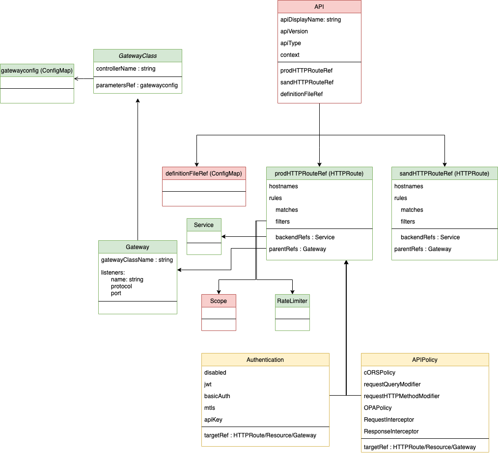

# API Specification

The following is the current design model of the Kubernetes CRDs that is being used for the 
APK data plane functionalities.

Please note the following color guide for CRDs.
- green : directly taken from the [Kubernetes Gateway API Specification](https://gateway-api.sigs.k8s.io/references/spec/)
- yellow : Designed according to the API Policy spec.
- red : Other custom filters 

## API mediations

### Request

1. Header

- add
  from spec : requestHeaderModifier
- set
  from spec : requestHeaderModifier
- remove
  from spec : requestHeaderModifier
- rename
  api policy

2. Query

- Remove all
  api policy
- Add
  api policy
- Remove
  api policy

3. Method
- change
  api policy

4. URL
- path rewrite
  from spec : urlRewrite

### Response

1. Header

- Add
  from spec : responseHeaderModifier
- set
    from spec : requestHeaderModifier
- Remove
  from spec : responseHeaderModifier  